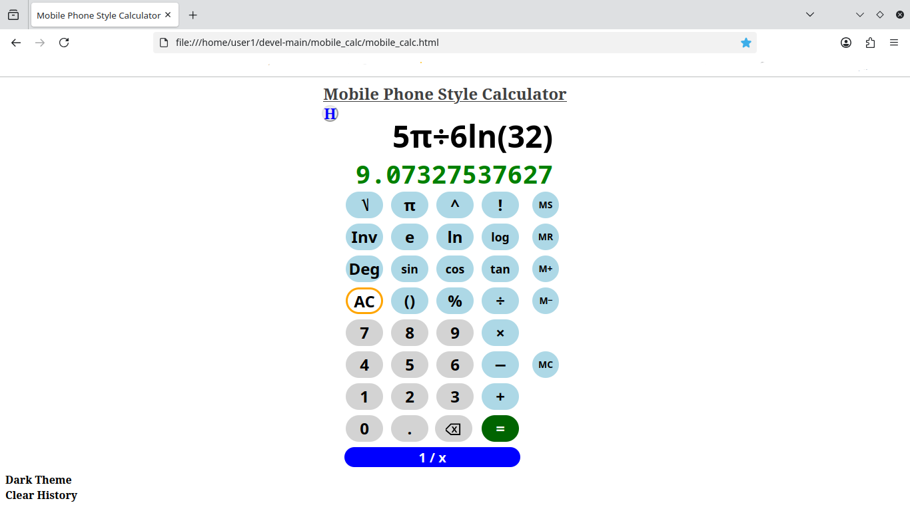
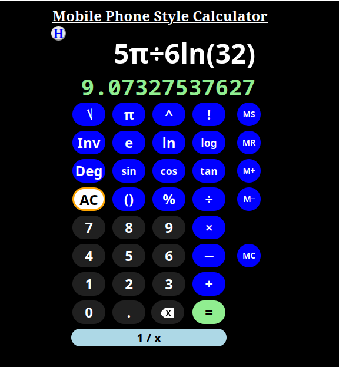

### Mobile Phone Style Calculator in a Single Webpage (HTML, Javascript, CSS)

</img>

#### Similar to the type of general purpose calculator that you might see that ships with a Google&reg; cellphone/mobile phone. It may look simplistic, but it has a lot of very cool features:
- Responsive Font Sizing for the expression input display, which is editable and touch scrollable.
- A standard list of functions available with a bonus *1/x* multiplicative inverse button.
- The usual memory functions as well as a *History* dropdown area that takes advantage of localStorage to hold expressions and results between uses.
- 'Light' and 'Dark' themes (see images).
- Implicit multiplication in expressions.
- Intuitive parenthesis insertion.
- Simplification of <i>log(int)</i> and <i>⎷int</i> functions and even fractional display for small decimal results!
- 'Right-click' on either the current expression or result and they're copied to the Clipboard.
- and much more...

"Dark Theme"
</img>

#### Meant to be used on a tablet or larger display; and it even works with numeric and keypad number and operation keys (+-*/)...
